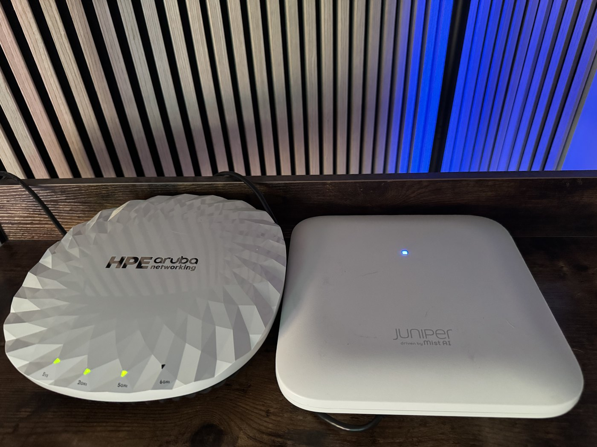
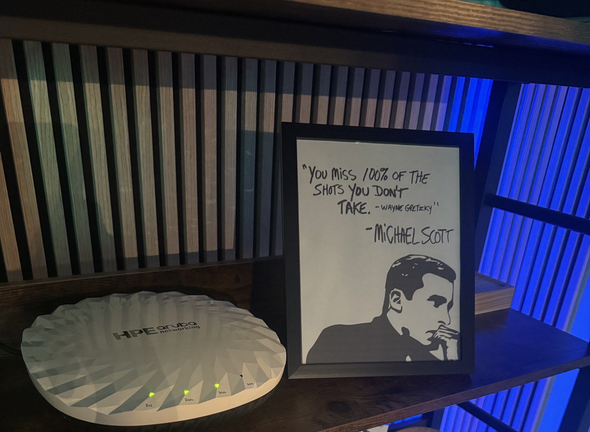

Last week was the room the radio lives in. This week is whether the signal actually gets across it.

A link budget is the arithmetic that tells you how loud your signal will be when it arrives. It takes about thirty seconds to write. I wrote one for my own lab, put an AP on a shelf, walked thirty two feet, and measured what my laptop actually heard. I was off by fifteen decibels, and the physics never moved. What moved was my understanding of what the number on my screen was measuring, and then of what my own measurement could prove. That's the lesson, and it isn't the arithmetic.

## Four numbers on a napkin

RSSI is what arrives. It's what you sent, plus what the antennas did at both ends, minus what the distance took away.

**Transmit power** is what the radio pushes into the antenna, before the antenna does anything to it. That's the textbook definition. Hold onto it, because your management platform may not be using it.

**Antenna gain** isn't amplification. Nothing passive adds energy. Gain is shape: the same power aimed more one way and less another. The datasheet prints the peak, and peak means the best direction, mounted the way they meant you to mount it. Power plus gain is EIRP, which is what the regulator cares about and what actually leaves the AP.

**The client's antenna** is the one nobody talks about. There's no datasheet for the antenna in your laptop. It's a strip of metal in a hinge, next to a battery, held by a hand. We put zero in that slot because we've got nothing else to put there, and then we forget that we guessed.

**Receive sensitivity** is the other end. Every radio has a table: this rate needs this much signal. The budget tells you what arrives, sensitivity tells you whether it's enough, and the difference is your margin.

Two of those terms are shapes nobody published. Both of them cost me a conclusion before this post was done.

## The number that matters

Free space path loss. It's the only term in the budget you can't argue with.

```
FSPL(dB) = 20·log10(d) + 20·log10(f) - 27.55
```

Distance in metres, frequency in megahertz. Worked once, for my lab: 32 ft is 9.75 m, and the primary channel is 149, which is 5745 MHz.

```
20·log10(9.75)  = 19.78
20·log10(5745)  = 75.19
19.78 + 75.19 - 27.55 = 67.4 dB
```

Nothing is absorbed in that formula and nothing is blocked. It's the wave spreading over the surface of a bigger and bigger sphere, and the sphere doesn't care what your building is made of.

Two things fall out of it on site. It's logarithmic, so the early metres are the expensive ones: one metre to ten costs 20 dB, ten to a hundred costs another 20, and doubling the distance always costs 6. And it has a minimum valid distance. Put the client on top of the AP and you're inside the near field, roughly 80 cm for a typical AP at 5 GHz, and the formula isn't inaccurate, it's meaningless. Ask me how I know. I threw away ten beautiful samples.

## What the gear shows you

Aruba Central showed `POWER 25 dBm` on the 5 GHz radio. My first instinct was to add the 5.5 dBi of published antenna gain and call it 30.5 dBm of EIRP. That's counting the antenna twice. Aruba's number already has it in.

The configuration docs say so in both generations: the AOS 10 radio profile calls the power range minimum and maximum EIRP, and the AOS 8 ARM profile says outright that it includes antenna gain. If you'd rather see it live, ask a controller what a radio is doing right now:

```
(controller) #show ap active
Radio 0 Band Ch/EIRP/MaxEIRP/Clients
AP:5GHz-HE:153/15.0/26.8/0
```

The column header says EIRP. Not power. It's been in that header for the better part of a decade, and it was the first place I should have looked. That's the answer, and it's an answer on paper. Hold that thought.

Juniper sits at the opposite end of the same quantity. Mist documents transmit power **per transmit chain**. Not total, not with the antenna, not with MIMO. One chain. The page hands you the arithmetic: add 10log of the chain count, then the antenna gain. For the AP34 on my bench, two by two with 6.0 dBi published, that's 15 plus 3 plus 6.0, or 24.0 dBm.

Except you'll hear it repeated everywhere that a beacon goes out on a single chain, and your survey tool's signal column is beacon derived. If that's true, the beacon is 15 + 6.0 = 21.0 and the MIMO term never belonged in the sum. I can't tell you whether it's true. Neither vendor says how many chains carry a beacon, and Aruba's own definition of MIMO gain includes cyclic delay diversity, which is exactly how a radio puts one stream out of every chain it owns. So the honest table is a range:

```
                    the screen     what it already has    what you add

Aruba AP-735        25 dBm         radio + antenna        nothing. it is EIRP.

Juniper AP34        15 dBm/chain   one chain, bare        +6.0 dBi antenna
                                                          +3 dB for the second chain,
                                                          if the frame uses it

Aruba, in the air                                         25.0 dBm
Juniper, one chain                                        21.0 dBm
Juniper, both chains                                      24.0 dBm
```

Ten decibels apart on the screens. One to four in the air.

**If you take one habit from this lesson, take that one.** Before you compare two APs, or feed a number into a survey tool, find out what the vendor means by power: EIRP, conducted, or per chain. The two screens are never comparable as printed, and between them sits six to nine decibels of pure notation before any physics has happened.

## The bench that couldn't answer

I didn't take the documentation on faith, which was right. Then I built an experiment that couldn't check it, which wasn't.

Both APs side by side on a shelf, a Sidekick ten feet away on the floor with line of sight, twelve readings, swapped left for right and averaged. At a known distance the path loss is known, so EIRP should fall straight out of a reading, and for the AP-735 it landed on 24.8 dBm against 25 displayed. Two tenths of a decibel. I very nearly published that as proof.

<figure>

<figcaption>Two vendors, one shelf, one noise floor, both radios transmitting at the same instant. Look at how they're lying. That's the problem.</figcaption>
</figure>

I'm leaving this one in on purpose, because it's the best worked example of the lesson I'm ever going to get, and it happened to me.

Both APs were lying on their backs, radome up, on a shelf four feet off the floor. The Sidekick was on the floor ten feet away. Now think about where the antenna was actually pointing.

The 730 datasheet says the built-in antennas are made for ceiling mount, with peak gain thirty to forty degrees below horizontal, so a ceiling AP aims at the floor. Turn that AP onto its back and the peak swings the other way: it now points thirty to forty degrees above horizontal, at the ceiling. My receiver, on the floor ten feet out, was about twenty degrees below horizontal. Add the two and the Sidekick was fifty to sixty degrees away from where the antenna was pointing hardest.

My derivation put zero in that slot. EIRP = RSSI + FSPL only works if the receiver saw the antenna's peak. It didn't, and sixty degrees off the peak of a 5.5 dBi antenna is usually worth five or six decibels. Put that guess back in and the derived EIRP comes out near 30 dBm, not 25. For about an hour I read that as the bench leaning toward the answer I didn't want, 25 dBm conducted with the antenna on top.

The datasheet closes that door. The 730 QuickSpecs put the AP-735's maximum conducted transmit power at 21 dBm per band, 18 dBm per chain, and say in so many words that the figure excludes antenna gain. Add the 5.5 dBi and the most this radio can radiate on 5 GHz is about 26.5 dBm EIRP. It cannot produce 25 dBm conducted, and it cannot produce 30 dBm of anything. So Central's 25 is EIRP, and a derivation that lands near 30 is not evidence about Central's number at all. It is evidence that my five-or-six decibel guess for the off-lobe loss was too small, which is the natural result of the receiver sitting in the back hemisphere of an AP lying on its ground plane. Two unmeasured shapes, one equation, and an answer that told me about the shapes, not the transmitter.

File the posture problem away. It comes back in lesson 11, when we put an AP on a survey stick and every reading it gives you is off a pattern the datasheet never measured.

**The documentation is the answer.** Both code generations say it, and a live CLI header has said it for a decade. That was always the strong evidence, and it owes nothing to my shelf.

## The lab

One AP, one laptop, about forty minutes.

1. Read the AP's power figure, and find out what that field means before you use it. Note the channel centre frequency, not the channel number.
2. Measure a distance and mark **the client spot** on the floor with tape. Mark the AP spot too, and label them differently. I marked only the AP position, told myself to stand on the tape, and took nine samples from two feet away before I noticed.
3. Predict. EIRP minus FSPL. Write it down before you measure, because a prediction you write afterwards isn't a prediction.
4. Measure. At least twenty samples from the client spot, standing still. Take the mean and the standard deviation.
5. Compare.

**What you should see.** A gap. Mine: 25 dBm of EIRP minus 67.4 dB of path loss predicts **-42.4 dBm**. I measured a mean of **-57.4** with a standard deviation of 2.0 across 22 samples. That's **15.0 dB**, and a standard deviation of 2 is far too tight for it to be noise.

**What it means.** Don't go hunting for what you forgot. Rearrange and solve for the term you guessed:

```
client antenna + off-lobe loss = RSSI - EIRP + FSPL
                               = -57.4 - 25 + 67.4
                               = -15.0 dB
```

I had put zero in that slot, the way everyone does. The real answer was -15.

My first guess was the laptop. Aluminium lid, right between the antenna and the AP, has to be worth ten. I turned the laptop around and took ten more samples. **1.4 dB.** Wrong by an order of magnitude. Here's where it actually went.

<figure>

<figcaption>Fifteen decibels, most of them right here. The radome is aimed at the underside of the next shelf up, about eighteen inches away. The datasheet says these antennas are optimised for horizontal ceiling mount, with peak gain thirty to forty degrees below the AP.</figcaption>
</figure>

That 5.5 dBi is real, and it's already inside Central's 25 dBm. It was just earned in a direction I wasn't using. The AP was on its back with its main lobe pointed at a plank, and my client was off to one side and slightly below. You don't get the peak by owning the datasheet.

Same term that wrecked the bench, same AP, same posture, different instrument. Off-lobe loss is the most reliable way a link budget lies to you, and it never shows up as an error. It shows up as a number.

**What means it's broken.** If the standard deviation across twenty stationary samples is more than about 3 dB, something is moving: a person, a microwave, or RRM changing power under you. Pin the channel and power before you measure, then read the Channel Changes and Power Changes counters on the AP in Central afterwards and confirm neither moved. Cheapest control in the building, and almost nobody uses it.

**So here's the habit.** Before you trust a measurement, write down every term you assumed rather than measured, and put a number on how big each one could be. If any of them is the size of the thing you're measuring, you don't have an experiment yet. You have a hope.

## Three questions

1. Central shows a radio at 25 dBm and Mist shows one at 15 dBm. Which is radiating harder, and what do you need to know about each platform, and about your own measurement, before you can answer?
2. Your predicted RSSI is -45 and you measure -65 with a 2 dB standard deviation. Which term do you solve for, and why not path loss?
3. You compare two APs against a calibrated receiver and they come back 5 dB apart. Name two explanations that have nothing to do with transmit power. Then say which of the two you could rule out without moving either AP, and which one you could not, because that second answer is the whole of this lesson.

## Next week

Modulation and data rates: why "speed" is a table, not a number, and why RSSI stops being the thing that matters.
