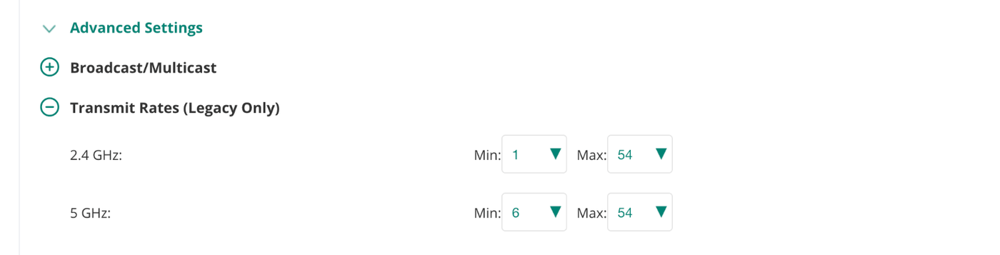
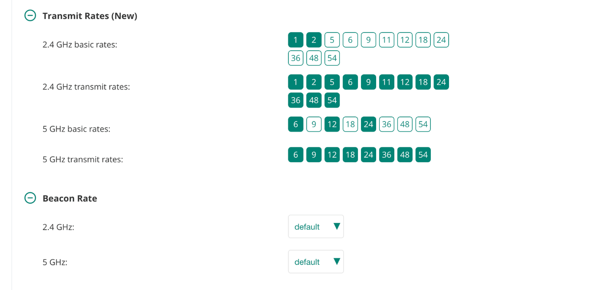
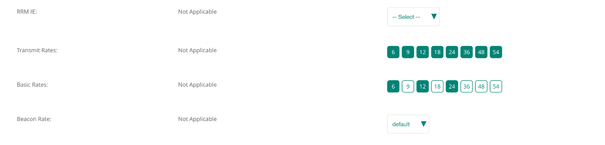
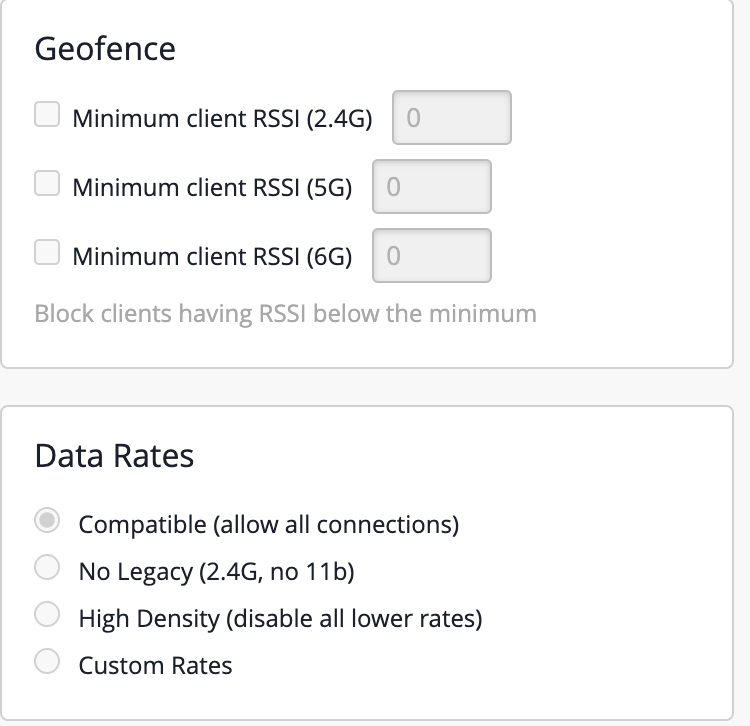

I'm starting the CWNE push. Four exams, the essays, the endorsements, the whole thing, and it starts with going back through the CWNA material that explains what a beacon is as if I've never seen one. Which is fine. It turns out I had seen plenty of beacons and read almost none of them.

The idea that stopped me is an old one. Every BSS advertises a rate set, a subset of it is flagged basic, and the standard says group-addressed management frames, which includes the beacon, go out at one of the basic rates. Every vendor I've ever touched picks the lowest. I know that. Everyone knows that. And then I thought about the screen I've clicked through on a hundred Central tenants, the one with a box called Transmit Rates (Legacy Only), minimum and maximum per band, and I realized I could not tell you, under oath, whether that box changes the beacon. I had a story about it. I did not have a capture.

So I got a capture. The AP-735 was on the shelf, the Mac was on the desk, and CWNE study is supposed to involve a packet or two.

## The question, stated properly

Central shows you rates in two places, and the study material only talks about one of them.

The WLAN page, General > Advanced Settings, has Transmit Rates (Legacy Only) with a minimum and maximum per band. That's the one everybody finds, and it's the one I'd always treated as a data floor.

<figure>

<figcaption>The box. Minimum and maximum per band, defaults 1 to 54 and 6 to 54, on the WLAN's own page. Nothing on it says beacon.</figcaption>
</figure>

Scroll down the same page and there's a second section, Transmit Rates (New), with the basic rates and transmit rates as chips per band, and under that a Beacon Rate picker. So the WLAN page carries all three ideas from the textbook on one screen, and they look independent.

<figure>

<figcaption>Same page, further down. 5 GHz basic rates 6, 12 and 24, every transmit rate on, and the beacon on default. This is the stock state of the SSID before I touched anything.</figcaption>
</figure>

Then there's the radio profile, Devices > Access Points > Config > Radios > Show advanced settings, which I had filed in my head as the place that really owns basic rates and the beacon, the way the RF profile does on a controller. I'll come back to that screen, because it had a surprise of its own.

{{figure: fig-mbr-two-screens.svg | Two screens in Central that look like they both own the rate set. One of them turns out to be for a band this test never touched.}}

The textbook model is three separate things. There's the rate set the BSS advertises, there's the subset of it flagged basic, which every client has to support to join, and there's the beacon, which goes out at a basic rate, the lowest one in practice. A box labelled minimum transmit rate sounds like it belongs to a fourth thing, the floor on data frames, which the textbook doesn't give a name to because the standard leaves it to the vendor. My guess going in: the box is the data floor, and the beacon doesn't care.

Place your bets.

## What one line in the config did

I set the 5 GHz minimum from 6 to 24 on the test SSID, my AP-735 on AOS 10.8.1.0, and pulled the running config through Tools > Commands. One line changed in the SSID profile: `a-min-tx-rate 24`. Nothing in the radio profile moved. Basic rates, beacon rate, untouched. So far the config agrees with my guess.

Then the sniffer.

```term
$ tshark -r capture.pcap -Y 'wlan.fc.type_subtype==8 && wlan.ssid=="NetFieldNotes"' \
    -T fields -e wlan_radio.data_rate -e wlan.ds.current_channel \
    -e wlan.supported_rates -e wlan.extended_supported_rates | sort | uniq -c
    590   24   149   0xb0,0x48,0x60,0x6c  <<
```

Five hundred and ninety beacons, every one of them sent at 24 Mb/s on channel 149, and a Supported Rates element four entries long. The hex is straight out of the Supported Rates element definition: units of 500 kb/s, high bit set means basic. `0xb0` is 24 with the basic flag. `0x48`, `0x60` and `0x6c` are 36, 48 and 54. No Extended Supported Rates element at all, because four rates fit in the first one with room to spare.

So 6, 9, 12 and 18 are not disabled. They're gone. The SSID no longer has them, the way it no longer has 11 Mb/s. And with 6 and 12 gone, the beacon rides the lowest basic rate left, exactly as the standard and the study guide say it should. The book was right, my guess was wrong, and the box is better than its label.

## Two screens, one knob

What the capture says is that the Legacy minimum isn't a data floor sitting beside the basic rates. It trims the SSID's rate set from the bottom. Everything under the minimum leaves the Supported Rates element, the basic flags on the survivors stay where they were, and the beacon follows.

And the radio profile, the screen I'd have gone to first on a controller? Here's what it shows for Transmit Rates, Basic Rates and Beacon Rate on this tenant.

<figure>

<figcaption>The radio profile, 5 GHz column on the left, 6 GHz on the right. For 2.4 and 5 GHz all three rate rows read Not Applicable. The pickers only exist for 6 GHz, which has no legacy rates for the WLAN page to cover.</figcaption>
</figure>

Not Applicable, for both 2.4 and 5 GHz. The radio profile's rate pickers exist only in the 6 GHz column, where there's no Legacy row on the WLAN page to do the job. So for the two bands with a legacy rate set, there was never a second screen. The WLAN page is the only knob, and the Legacy minimum on it is the one that moves the beacon. I'd been carrying a controller-era mental map onto a product that doesn't use it.

On the CLI side this is the Instant lineage showing through. Instant's `wlan ssid-profile` carries `a-basic-rates`, `a-tx-rates`, `a-beacon-rate` and the `a-min-tx-rate` and `a-max-tx-rate` pair, defaults 6 and 54. AOS 10 kept the pair, and Central's Legacy boxes are a front end for it. AOS 8 under a controller has the basic and tx rate lists in the same profile but no min and max pair, so the equivalent change there is editing `a-basic-rates` and `a-tx-rates` by hand. If you came up on controllers, the AOS 10 box is doing both of those edits for you in one move, and not telling you.

## What it costs, and what it buys

The reason the study material cares about the beacon rate is airtime, and this is where the box earns its keep. A beacon is a management frame with a 250 byte body on this SSID, 278 bytes once the 802.11 header and FCS are on it. At 6 Mb/s that's 396 microseconds on the air, ten times a second, per SSID, per radio, forever. At 24 Mb/s it's 116.

{{figure: fig-mbr-airtime.svg | One beacon, then six SSIDs' worth. The beacon is the fixed cost of an SSID existing, and the minimum rate is the only thing that changes its size.}}

On one SSID that's 0.4 percent of a radio down to 0.1, which nobody will notice. On a six-SSID AP it's 2.4 percent down to 0.7. On 2.4 GHz with 1 Mb/s still enabled, which is the default, six SSIDs spend a seventh of the channel saying their names before any client speaks. [Lesson 10](academy-10-capacity-not-coverage.html) works that arithmetic in full. The point here is narrower: this box is the one that moves it, and the client page will never show you that it did.

## Who still sees the SSID

Here's the part the study guide puts in a warning box, and it deserves one. A client can only join where it can decode a beacon, and a beacon at 24 needs about 8 dB more signal than one at 6. That's the cell shrinking, which is what you wanted. But a client that can't do 24 at all, not at any distance, stops seeing the SSID entirely. It doesn't fail to connect. The network isn't there.

{{figure: fig-mbr-ladder.svg | The OFDM rate ladder after the change. Anything that lived on the bottom four rungs has nowhere to stand.}}

On 5 GHz with a 24 Mb/s floor, every 802.11a radio ever made can still join, because 24 is one of the three mandatory OFDM rates and 802.11a has always required it. So in theory nothing falls off. In practice the devices that live at the cell edge on 6 Mb/s are the ones with one antenna behind a metal bracket, and they will now hold on at 24 or not at all. The scanner that used to limp along at the far end of the warehouse at 6 Mb/s now has no SSID at the far end of the warehouse. It's always a scanner. Or a printer. And check the 2.4 GHz row before you touch it too, because the same box there can take 1, 2, 5.5 and 11 away, and there are still 802.11b-only radios in the world, mostly screwed to walls.

## How to see it yourself

The client page shows data rates. The beacon rate shows up in exactly one place, which is a capture, and the capture turned out to be the hard part.

{{figure: fig-mbr-capture.svg | The capture route on a Mac. The obvious tool returns nothing; the one in the Wireless Diagnostics window works.}}

On a Mac, `tcpdump -I` opens monitor mode without complaint and then delivers zero frames on Apple silicon while the Mac is associated. No error, just silence, which is the worst kind of error. Disassociating fixes it and also drops you off the network you're working from. The route that works is Wireless Diagnostics, which is behind Option-click on the Wi-Fi menu. Window > Sniffer, pick the AP's channel and width, run it for ten seconds, and it writes a pcap into `/var/tmp`. Then the tshark line at the top of this post prints the rate and the rate set for every beacon from your SSID, and `uniq -c` collapses them into one line if the AP is consistent, which it was.

Read the rate set as hex, high bit for basic. The default 5 GHz set on this AP was 6, 9, 12, 18, 24, 36, 48 and 54 with 6, 12 and 24 basic. Afterwards it was four entries. If you only ever read the Central client page, both states look identical.

## What Mist does with the same knob

Since the exam doesn't care whose logo is on the AP, I checked the other one in the house. Mist puts it on the WLAN as a Data Rates block with four presets, and the presets say what they do.

<figure>

<figcaption>Mist's version of the same knob on my lab WLAN, with Geofence above it because the two get confused for each other. Compatible is the default.</figcaption>
</figure>
 Compatible is everything enabled and a 1 Mb/s minimum. No Legacy drops 802.11b. High Density sets the minimum to 24 and disables everything below it, which is the same end state I got from the Aruba box, labelled honestly. Custom lets you mark each rate Disabled, Supported or Mandatory per band, and the lowest Mandatory is the beacon rate. The doc is careful to say this controls the AP's transmissions and that a client may still send at a rate you disabled.

That's the difference, and it's a small one. Mist's picker is named for the outcome. Central's is named for one of the two things it changes.

## Bottom line

The textbook sentence holds: the beacon goes out at a basic rate, and on every AP I've met, the lowest one. What the textbook can't tell you is which box in which vendor's UI decides what the lowest basic rate is, and on AOS 10 it's the one labelled minimum transmit rate, on the WLAN page, because for 2.4 and 5 GHz the radio profile doesn't have one. Beacons, basic rates, data, all of it, from one picker. That's a better outcome than the label promises, because the beacon is where the airtime goes. It also means the thing you did to tidy up data rates just rewrote the rate set for every client in the building, and anything that can't decode 24 won't see the SSID again. Capture before and after. The client page shows data rates. Only the beacon shows the beacon.
